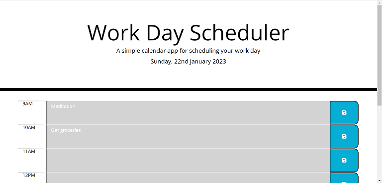
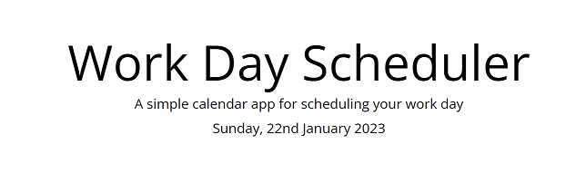
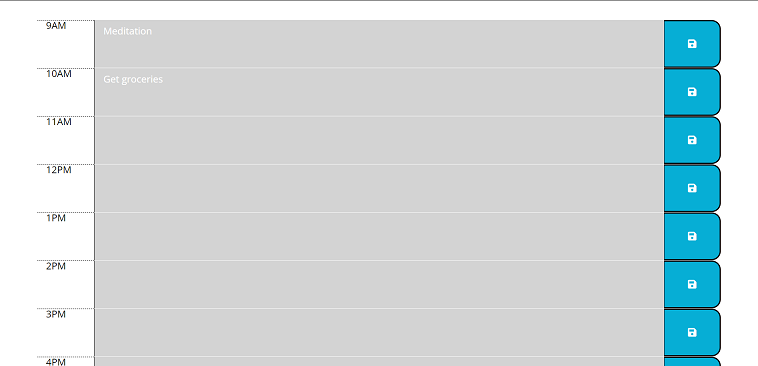
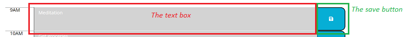
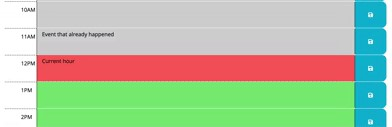

# Work Day Scheduler
## Description
Welcome to the [Work Day Scheduler](https://cl-lee.github.io/work-day-scheduler/) repo! This project features a daily planner application to help employees manage their time on a 9am to 6pm work day.

## Prerequisites
A web browser is required to access the application.

## Usage
### Application link  
The application can be accessed through the following URL: https://cl-lee.github.io/work-day-scheduler/.  
  

### Application layout
- #### The header
    At the top of the application web page is the header. Inside the header is a short description of this app and today's date.  
    

- #### The main section
    The main section contains the planner itself. In the planner are nine hourly timeblocks starting from 9am and ending at 5pm. Inside each timeblock are the hour, a textbox and a save button.  
    
    - The hour: Found on the left in the timeblock, it shows the corresponding hour of the timeblock
    - The textbox: Found in the middle, for entering and showing event or task item(s)
    - The save button: for saving entries in the textbox  
    

### Application usage
- #### Saving and viewing a task/event
    Users can enter task or event item(s) in a timeblock's text box. They can then click on the save button to store the item(s) on their machines. Once saved, the item(s) will remain in the timeblock after restarting the application web page.  

- #### The past, current and future hours
    The timeblocks' textbox features a colour-code function based on the current time. Timeblocks with hours gone by will have their textboxes highlighted in grey, the current hour in red, and future hours in green.  
    
